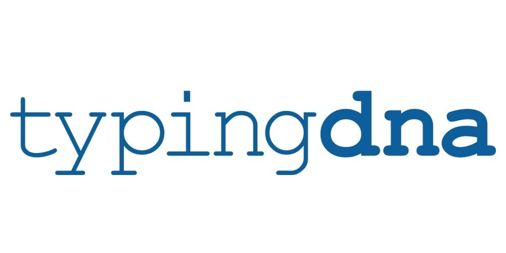

# Typing DNA hackathon project




# Event-driven-programming game with pattern recognition API

## How to use

```
$ npm ci
$ npm start
```

And point your browser to `http://localhost:3000`. Optionally, specify
a port by supplying the `PORT` env variable.

## Features

You can enter your player nick name and text to register your pattern.
After that you start to emulate some other users writing pattern.
The score on the left represents how much closer you are on the pattern of that specific user.
If you emulate the writing patern of that user, that user is eliminated.
The last user standing wins.

## Local development

For local testing and development create locally a ".env" file in which you store your credentials for the Typing DNA API. You can create a free account [here](https://www.typingdna.com/) where you can retrieve your credentials.

Example of ".env" file:

```
APIKEY=<YOUR_API_KEY_HERE>
APISECRET=<YOUR_API_SECRET_HERE>
THRESHOLD=50
PORT=3000
QUALITY=1
```

After you complete the file with your credentials, it's time to look as the 
other parameters:

THRESHOLD: if a user obtains a similarity score better than this one. the user is eliminated.

PORT:The port the server uses.


QUALITY: The specific way the TYPING DNA will evaluate the corelation between two patterns. For more details chec the [API](https://api.typingdna.com/#api-API_Services-verifyTypingPattern). (Note: in the implimentation i used the net score that resulted in the comparison between users)

## Structure 

main.js : The main file of the application where the managemnent of the users is done.

utils.js : Functions that make use of the TypingDNA API and other helpfull functions.

public\main.js : Frontend management of the user.

public\index.html : Interface of the user.

public\style.css : Styling for the user.


